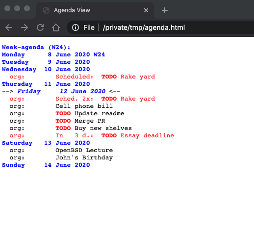

# agenda-html

Export an HTML version of org-agenda without opening Emacs. I made this so i could run it as part of a script in my crontab every ~15 minutes in order to have my home page in firefox and chrome as an up-to-date version of my org-agenda.

## Configuration
Modify `org-agenda-files` in `config.el` to contain the paths to the org files you want to include in your agenda.

Modify `agenda-html-file` with the desired location for the HTML output.

## Running

To run the script, clone the repository, modify the config file and run `agenda-html.sh`

If running this from a crontab, make sure the environment is set up correctly, as cron often runs jobs with a minimal `$PATH`.

## Extensions

This extension can be used to set the new tab page in [Chrome](https://chrome.google.com/webstore/detail/custom-new-tab-url/mmjbdbjnoablegbkcklggeknkfcjkjia)

## Example

